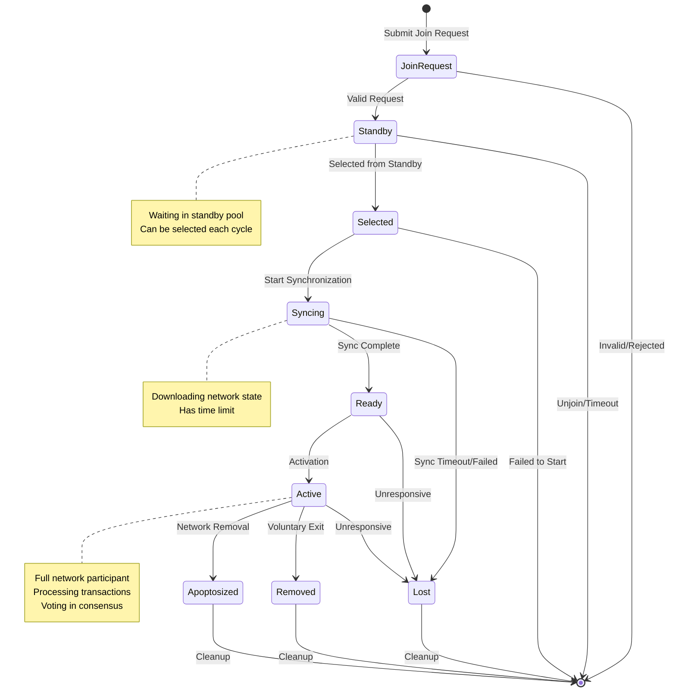
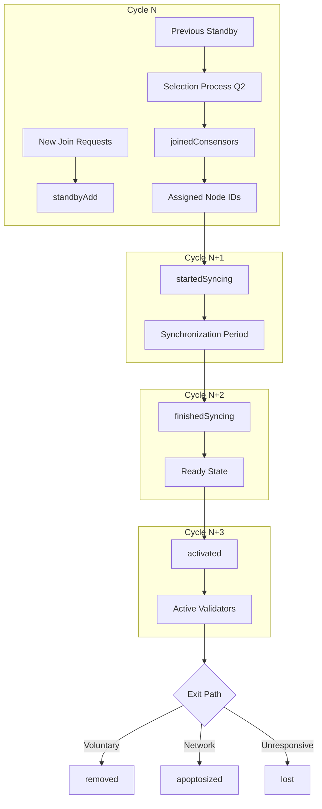

# Shardeum Validator Lifecycle Documentation

## Overview

The Shardeum network operates on a cycle-based consensus system where validators (nodes) progress through various states as they join, participate in, and potentially leave the network. Each cycle lasts 60 seconds and represents a consensus round where the network collectively agrees on state changes.

## Key Concepts

### Validator Identity
- **Public Key**: Constant identifier that remains the same throughout a validator's lifetime (e.g., `8c909f637f7e1c1d53c467a860df816358a88be2b277112b0d883e05fc931210`)
- **Address**: Derived from the public key, also constant
- **Node ID**: A 32-byte address assigned when a validator is accepted to go active (e.g., `07f2c308a7079e1c41ac195fb26510087ab561b548b84f7d63006d32101f1971`)

### Cycle Structure
Each cycle contains various lists that track validator state changes:
- `standbyAdd`: New validators entering the standby pool
- `standbyRemove`: Validators leaving the standby pool  
- `joinedConsensors`: Validators selected from standby to join the network
- `startedSyncing`: Validators beginning the synchronization process
- `finishedSyncing`: Validators that completed synchronization
- `activated`: Validators becoming fully active
- `removed`: Validators being removed from the network
- `apoptosized`: Validators removed through the apoptosis process (network-initiated removal)
- `lost`: Validators that have become unresponsive

## Validator States and Lifecycle

### 1. Initial Join Request
When a validator wants to join the network, it:
1. Generates a join request with its node information
2. Calculates a Proof of Work (POW) to prevent spam
3. Submits the join request to active nodes in the network
4. The join request includes:
   - Node information (public key, IP addresses, ports)
   - Proof of Work
   - Selection number (used for fair selection)
   - Application-specific join data (version, certificates)

### 2. Standby State
- New join requests are collected during each cycle
- At cycle digestion, validated requests are added to the `standbyAdd` list
- Validators in standby wait to be selected to join the active network
- The standby list maintains a hash for verification (`standbyNodeListHash`)
- Standby nodes can be removed via `standbyRemove` if they disconnect

### 3. Selection Process (Quarter 2 of Cycle)
During the second quarter of each cycle:
1. The network calculates how many nodes to accept based on current/target size
2. Nodes are selected from standby using a deterministic algorithm:
   - Standby nodes are sorted by their selection number
   - An offset is derived from the current cycle marker for fairness
   - The top N nodes (based on network needs) are selected
3. Selected nodes appear in the `joinedConsensors` list with:
   - Their newly assigned node ID
   - The cycle they joined (`cycleJoined`)
   - Timestamps for tracking progress

### 4. Syncing State
Selected validators must synchronize with the network:
- Appear in `startedSyncing` list when synchronization begins
- Status changes to `SYNCING`
- Must download current network state and recent transactions
- Synchronization has a maximum time limit (`maxSyncTime`)
- Can fail and be added to `lostSyncing` if they don't complete in time

### 5. Ready State  
After successful synchronization:
- Validators appear in `finishedSyncing` list
- Status changes to `READY`
- They have all necessary data but aren't yet participating in consensus
- Ready timestamp is recorded

### 6. Active State
The final transition to full participation:
- Validators appear in the `activated` list
- Their public keys are added to `activatedPublicKeys`
- Status changes to `ACTIVE`
- They now participate in:
  - Transaction processing
  - Consensus voting
  - Data storage for their assigned shard
  - Network maintenance operations

### 7. Removal/Exit
Validators can leave the network through:
- **Voluntary exit**: Initiate an unjoin request
- **Apoptosis**: Network-initiated removal for various reasons (performance, behavior)
- **Lost node detection**: Unresponsive validators are marked as lost
- **Application removal**: Removed by application-specific logic

## Network Modes

The network operates in different modes that affect validator lifecycle:

### Forming Mode
- Initial network formation phase
- Special rules for the first validator (doesn't go through normal join process)
- Gradually builds up to the desired network size

### Processing Mode
- Normal operational mode
- Standard join/leave processes apply
- Rotation may be enabled to refresh the validator set

### Safety Mode
- Activated during network issues
- May restrict new joins
- Focuses on maintaining existing validators

### Restart Mode
- Used when restarting from a previous network state
- Special selection rules apply

## Cycle Digestion and State Updates

The `digestCycle()` function in `Sync.ts` is crucial for processing cycle changes:

1. **Hash Verification**: Validates node list hashes for consistency
2. **Parse Changes**: Extracts all state changes from the cycle record
3. **Apply Updates**: 
   - Adds new nodes from `joinedConsensors`
   - Updates node states for syncing/ready/active transitions
   - Removes nodes that have left
4. **Standby Management**: Updates standby list based on adds/removes
5. **Chain Update**: Appends the cycle to the cycle chain

## Special Considerations

### First Validator
The first validator in a network is special:
- Bypasses normal join protocol
- Added directly with `cycleJoined: "0000...0000"`
- Immediately participates in network formation

### Rotation
When enabled, rotation periodically removes older validators and accepts new ones to maintain network freshness. This appears to be disabled in the example data (10-node network with no rotation).

### Golden Ticket
Special administrative capability that allows certain nodes with valid certificates to bypass normal selection and join immediately.

## Mermaid Diagram: Validator State Transitions

## Cycle Record Flow

## Implementation Details

### Key Files
- `src/p2p/Join/v2/index.ts`: Join protocol v2 implementation
- `src/p2p/Join/v2/select.ts`: Node selection from standby
- `src/p2p/Sync.ts`: Cycle digestion and state synchronization
- `src/p2p/CycleCreator.ts`: Cycle record creation
- `src/p2p/NodeList.ts`: Node list management

### Important Functions
- `digestCycle()`: Processes cycle changes and updates network state
- `selectNodes()`: Selects validators from standby pool
- `addStandbyJoinRequests()`: Adds new validators to standby
- `applyNodeListChange()`: Updates the active node list

## Timing Considerations

- **Cycle Duration**: 60 seconds
- **Cycle Quarters**: Q1-Q4, each ~15 seconds
- **Q2**: Node selection occurs
- **Max Sync Time**: Configurable limit for synchronization
- **Join Request Timestamp**: Recorded for tracking node age

## Network Growth Strategy

The network manages growth through:
1. **Desired vs Active**: Tracks target network size vs current size
2. **Controlled Acceptance**: Limits how many nodes join per cycle
3. **Standby Pool**: Maintains buffer of ready-to-join validators
4. **Selection Fairness**: Uses cycle marker offset for fair selection

This architecture ensures orderly network growth while maintaining decentralization and preventing rushed joins that could destabilize the network.